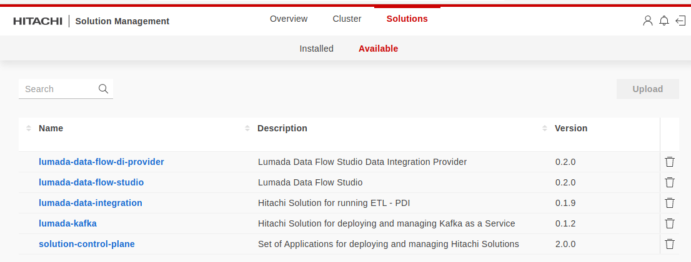
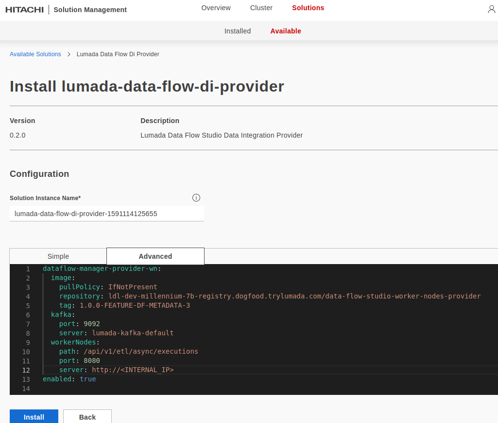

#Deploying DFS to an AWS cluster lifecycle

 

There are, basically, two phases to this:

- The first one, starts when a _pull request_ is merged. That will trigger a **Github Actions** workflow execution that will take the _new_ source code, compile it and upload/deploy the generated artifacts to **Artifactory**. All workflow definitions live in [https://github.com/pentaho/dataflow-manager/tree/BRANCH_NAME/.github/workflows](https://github.com/pentaho/dataflow-manager/tree/BRANCH_NAME/.github/workflows). This phase is an automatic process.

- The second phase, requires human interaction and for that, we need to _fork_ the **Corellia** project ([http://gitlab.wal.hds.com/tapestry/corellia/](http://gitlab.wal.hds.com/tapestry/corellia/)) - _if not done already_! 

On that code base, we need to replace the old versions of the artifacts by the new ones. An helpful command might be (from Corellia's root folder):
```
grep -ril "OLD-VERSION" | xargs sed -i s/OLD-VERSION/NEW_VERSION/
```
At this time, running the above command, will change the following files:

```
$CORELLIA_ROOT/config/config.yaml
$CORELLIA_ROOT/solutions/charts/lumada-data-flow-di-providerChart.yaml
$CORELLIA_ROOT/solutions/charts/lumada-data-flow-studio/Chart.yaml
$CORELLIA_ROOT/solutions/charts/lumada-data-flow-di-provider/values.yaml
$CORELLIA_ROOT/solutions/charts/lumada-data-flow-studio/values.yaml
```

Having done that, the versions should be updated and we need to run the `tapestry-deploy.sh` bash script with the appropriate arguments.

Running the mentioned script with no arguments will give you all available options (**Notice that there are a few requirements that need to be in place before any successful execution. Take the necessary time to put them into place beforehand**):
```
$ ./tapestry-deploy.sh 

==============================================================================================================
 (1) Ensure the following cli tools are installed/available:                                                  
                                                                                                              
    - docker: https://docs.docker.com/get-docker                                                              
    - kubectl: https://kubernetes.io/docs/tasks/tools/install-kubectl                                         
    - helm: https://helm.sh                                                                                   
    - aws-cli: https://aws.amazon.com/cli                                                                     
    - jq 1.6: https://stedolan.github.io/jq                                                                   
    - yq 3.3: https://github.com/mikefarah/yq#yq                                                              
                                                                                                              
    (1.1) if on OSX:                                                                                          
                                                                                                              
        - gnu-sed: https://daoyuan.li/a-normal-sed-on-mac                                                     
        - greadlink: (part of) https://formulae.brew.sh/formula/coreutils                                     
        - bash v4+: https://stackoverflow.com/questions/6047648                                               
                    https://clubmate.fi/upgrade-to-bash-4-in-mac-os-x                                         
                                                                                                              
 (2) Ensure you are logged in to aws ( okta-aws ):                                                            
                                                                                                              
    Verify this by running 'aws <profile> sts get-caller-identity'                                            
                                                                                                              
 (3) Usage:                                                                                                   
                                                                                                              
    tapestry-deploy.sh (<arg>=<string-val>)*                                                                  
       -l    | --location          : ['on-prem'/'aws']. Required. **NOTE**: 'on-prem' is not available yet    
       -s    | --solutions         : comma-separated list of solutions to install. Optional, defaults to all  
       -fv   | --foundry-version   : Foundry version. Optional, defaults to 2.0.0.375        
       -fr   | --foundry-reinstall : [true/false]. Optional, defaults to false         
       -ap   | --aws-profile       : Optional, defaults to whatever aws profile's currently set               
       -acn  | --aws-cluster-name  : Required if --location=aws                                               
       -rff  | --run-foundry-forge : [true/false]. Optional, defaults to false         
       -opr  | --on-prem-registry  : Required if --location=on-prem                                           
       -oph  | --on-prem-hostname  : Required if --location=on-prem                                           
       -opkx | --on-prem-kube-ctx  : Required if --location=on-prem                                           
                                                                                                              
 (4) Usage examples:                                                                                          
                                                                                                              
    tapestry-deploy.sh --location=aws --aws-cluster-name=ldl-dev-bb8-08 --aws-profile=dev                     
    tapestry-deploy.sh -l=aws -fr=true -fv=2.0.0.433 -acn=ldl-dev-bb8-c7                                      
    tapestry-deploy.sh -l=on-prem -fr=true -opr=f19-2-vm7:5000 -oph=f19-2-vm7.lab.archivas.com                
    tapestry-deploy.sh -l=on-prem -opr=d5-28:5000 -oph=d5-28 -s=lumada-data-lake,lumada-kafka,lds-spark       
                                                                                                              
==============================================================================================================

```

Taking Millennium's `dev` cluster as example, one can do a standard cluster instalation as such:

```
./tapestry-deploy.sh -l=aws -fr=true -acn=ldl-dev-millennium-7b -ap=default -s=lumada-kafka,lumada-data-flow-di-provider,lumada-data-flow-studio,lumada-data-integration
```

When the above execution finishes, if successful, the different solutions, should be available to install in the cluster's sontrol plane:

 

#Installing DFS on the cluster

In your cluster's Control Plane ([https://ldl-dev-millennium-7b.dogfood.trylumada.com/](https://ldl-dev-millennium-7b.dogfood.trylumada.com/)), from the _**Solutions > Available**_ tab, proceed to install the solutions in such order:

- lumada-kafka
- lumada-data-integration
- lumada-data-flow-studio

The installation should be trivial - just click the _install_ button. 

After those solutions are installed, we need to the same for `lumada-data-flow-di-provider` but a few things need to happen before doing that. One must run 
```
kubectl get services | grep lumada-data-integration
```
to obtaing the cluster's internal IP associated with the `lumada-data-integration` service. Copy that IP and go back to the Foundry Control Plane `Solutions > Available`and select `lumada-data-flow-di-provider`. In the Configuration section, paste the copied IP into the `server` attributte of the `workerNodes`section of the presented `yaml`:

 

Finish the installation by clicking the _install_ button.

On `aws` the keycloack admin console is not exposed by default - this might be temporary, depending on future versions of `Foundry`. To expose it, **run the following steps only on the first installation**:

1. Copy the following source to a `nginx-ingress-controller.yaml` file:
```
apiVersion: v1
data:
  proxy-buffer-size: 256k
  proxy-buffers: 16 256k
kind: ConfigMap
metadata:
  annotations:
    control-plane.alpha.kubernetes.io/leader: '{"holderIdentity":"solution-control-plane-nginx-ingress-controller-m57ls","leaseDurationSeconds":30,"acquireTime":"2020-04-27T10:26:47Z","renewTime":"2020-04-27T10:30:50Z","leaderTransitions":0}'
  creationTimestamp: "2020-04-27T10:26:47Z"
  name: nginx-ingress-controller
  namespace: nginx-ingress
  resourceVersion: "2530407"
  selfLink: /api/v1/namespaces/default/configmaps/ingress-controller-leader-nginx
```
and execute it
```
kubectl apply -f nginx-ingress-controller.yaml
```

2. Copy the following source to a `keycloack-ingress.yaml` file (make sure to replace the `<CLUSTER_NAME>` occurrences by your cluster name):
```
apiVersion: extensions/v1beta1
kind: Ingress
metadata:
  annotations:
    kubectl.kubernetes.io/last-applied-configuration: |
      {"apiVersion":"extensions/v1beta1","kind":"Ingress","metadata":{"annotations":{"kubernetes.io/ingress.class":"nginx","nginx.ingress.kubernetes.io/backend-protocol":"HTTPS","nginx.ingress.kubernetes.io/ssl-passthrough":"true"},"name":"keycloak","namespace":"default"},"spec":{"rules":[{"host":"<CLUSTER_NAME>.dogfood.trylumada.com","http":{"paths":[{"backend":{"serviceName":"keycloak","servicePort":8443},"path":"/auth"}]}},{"http":{"paths":[{"backend":{"serviceName":"keycloak","servicePort":8443},"path":"/auth"}]}}]}}
    kubernetes.io/ingress.class: nginx
    nginx.ingress.kubernetes.io/backend-protocol: HTTPS
    nginx.ingress.kubernetes.io/ssl-passthrough: "true"
  creationTimestamp: "2020-04-02T00:12:19Z"
  generation: 9
  labels:
    keep: "true"
  name: keycloak
  namespace: default
  resourceVersion: "14938536"
  selfLink: /apis/extensions/v1beta1/namespaces/default/ingresses/keycloak
spec:
  rules:
  - host: <CLUSTER_NAME>.dogfood.trylumada.com
    http:
      paths:
      - backend:
          serviceName: keycloak
          servicePort: 8443
        path: /auth
  - http:
      paths:
      - backend:
          serviceName: keycloak
          servicePort: 8443
        path: /auth
```
and execute it
```
kubectl apply -f keycloack-ingress.yaml
```
3. Enable ssl passthrough by executing the following command:
```
kubectl edit deployments -n nginx-ingress nginx-ingress-controller
```

Then in `spec->template->spec->containers->args` add `- --enable-ssl-passthrough`

**The following steps are required every time lumada-data-flow-studio ins installed/reinstalled:**

- Execute:
```
kubectl get secrets | grep "lumada-data-flow-studio-*"
```
As a result you'll get an entry with the name `lumada-data-flow-studio-<SOME_NUMBER>-sso-gatekeeper`.
Copy the `<SOME_NUMBER>`

- Create a `.sh` file with the following source (replace the `<SOME_NUMBER>` occurrence with the value obtained in the previous step and `<CLUSTER_NAME>` occurrences by your cluster name):
```
#!/bin/bash
DEBUG=1
SLN=${1:-lumada-data-flow-studio-<SOME_NUMBER>}
echo "SLN: $SLN"
DISCOVERY_URL=https://<CLUSTER_NAME>.dogfood.trylumada.com/auth/realms/master
GATEKEEPER_SECRET="$SLN-sso-gatekeeper"
GATEKEEPER_YAML="$GATEKEEPER_SECRET.yaml"
JSON_DATA_PATH=".data.\"$GATEKEEPER_YAML\""
function tmpfile() {
    local tmp_filename=$1
    local tmpfile=$(mktemp /tmp/lcp-$tmp_filename.XXXX)
    exec 3>$tmpfile
    rm $tmpfile
    echo $tmpfile
}
function log() {
    [ -z "$DEBUG" ] && return 0
    echo $@
}
function log_file() {
    [ -z "$DEBUG" ] && return 0
    echo "-----------------"
    cat $1
    echo "-----------------"
    echo
}
TMP_DATA_SRC=$(tmpfile data-src)
kubectl get secret $GATEKEEPER_SECRET -o json | jq -r "$JSON_DATA_PATH" | base64 -d >$TMP_DATA_SRC
log "Retrieved secret data:"
log_file $TMP_DATA_SRC
TMP_DATA_DEST=$(tmpfile data-dest)
cat $TMP_DATA_SRC | yq w - 'discovery-url' $DISCOVERY_URL >$TMP_DATA_DEST
log "Updated secret data to:"
log_file $TMP_DATA_DEST
TMP_PATCH_FILE=$(tmpfile secret-patch)
jq -nc --arg "$GATEKEEPER_YAML" "$(cat $TMP_DATA_DEST | base64)" '{"data" : $ARGS.named}' > $TMP_PATCH_FILE
log "Sending patch:"
log_file $TMP_PATCH_FILE
kubectl patch secret $GATEKEEPER_SECRET --type merge --patch "$(cat $TMP_PATCH_FILE)"
```
Execute the script.

- Go to https://`<CLUSTER_NAME>`.dogfood.trylumada.com/auth/admin/ and login with:
```
User: admin
Password: cXoEFfRsWx
```
1. Select `Clients` then `lumada-data-flow-studio-<SOME_NUMBER>-sso-client`
2. Set the `Valid Ridirect URIs` value to : `http://<CLUSTER_NAME>.dogfood.trylumada.com/dataflow-manager/oauth/callback`
3. Save.

Data Flow Studio should be available at `http://<CLUSTER_NAME>.dogfood.trylumada.com/dataflow-manager`

#Installing data flows in a Foundry enviroment

At this moment, there isn't an UI to achieve this goal. There are some documentation that explains how to this as manual steps. An effort was made to automate those steps.

A script is available at [https://github.com/cardosov/scripts/blob/master/tapestry/pdi-to-foundry.sh](https://github.com/cardosov/scripts/blob/master/tapestry/pdi-to-foundry.sh), that has the purpose of taking a zip file exported in `PDI`, invoke the metadata endpoint that will generate the `JSON` with the `ktr` metadata and the zip content in `base64`, and upload it to a cluster.

Calling this script with the `-h` argument, will show all the options available:
```
$ ./pdi-to-foundry.sh -h
  Usage: ./pdi-to-foundry.sh [-c | --credentials ]=admin:pwd [-z | --zip-file ]=/some/where/file.zip ...

  -c   | --credentials  	: sets the credentials for the metadata endpoint in "user:pwd" format
  -z   | --zip-file     	: sets the local zip file location
  -e   | --entry-point  	: sets the entry point inside the zip
  -p   | --provider-id  	: sets the provider. Defaults to 'pdi-ktr'
  -w   | --provider-id-wn	: sets the provider id for the workernodes in foundry. Defaults to 'pdi-wn'
  -m   | --metadata-url		: sets the URL for the metadata generator endpoint. Defaults to 'http://172.20.42.207:8080/pentaho/osgi/cxf/dataflow-manager/generator/zip'
  -f   | --foundry-url		: sets the URL for the foundry env
  -s   | --sso-client      	: sets the SSO client from Keycloak
  -ss  | --sso-secret      	: sets the SSO client secret from Keycloak
  -h   | --help         	: displays this usage guide
```
An example of a command line might be:
```
./pdi-to-foundry.sh -z=/home/user/a-folder/all-types.zip -f=https://ldl-dev-millennium-7b.dogfood.trylumada.com -s=lumada-data-flow-studio-15234-sso-client -ss=6f8dbe7d-dc1f-44e2-9860-48ab947e017d
```
#####How to retrieve the values for the `-s or --sso-client` and the `-ss or --sso-client-secret` arguments:

1. You need to loggin to your `Keycloak` console (ex.: http://ldl-dev-millennium-7b.dogfood.trylumada.com/auth/admin);
2. got to the `Clients` option of the left side bar;
3. Choose the `Client ID` that is named as `lumada-data-flow-studio-<SOME_NUMBER>-sso-client` - that is value for the `-s or --sso-client` argument;
4. when in the client's detail, click the `Credentials` tab (second from the left) and the value for the `-ss or --sso-client-secret` will be in the `Secret` field.

After the successful execution of the `pdi-to-foundry.sh`, a new data flow will appear in `Data Flow Studio`.
