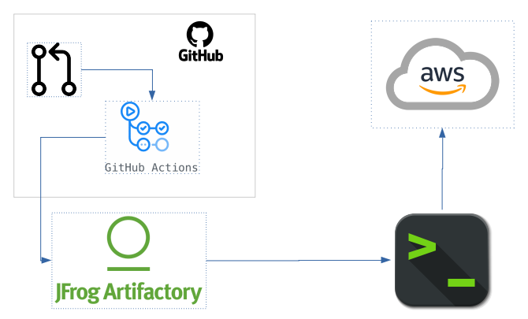

# Deploying DFS to an AWS cluster lifecycle

### Assumptions

- You are able to connect to `aws` clusters from the command line. Meaning , you have `awscli` and `okta` utils installed; you have `kubectl` also installed and all the necessary clusters configured in you `kubeconfig`. If not see:
	- [http://gitlab.wal.hds.com/pteixeira/corellia/-/blob/acclamator_assault_ship-stable/CONTRIBUTING.md#authentication-into-aws-dogfood](https://insightgroup.atlassian.net/wiki/spaces/TPY/pages/1664746094/Data+Flow+Studio)
	- [https://insightgroup.atlassian.net/wiki/spaces/TPY/pages/1354958049/Connecting+to+a+AWS+cluster](https://insightgroup.atlassian.net/wiki/spaces/TPY/pages/1664746094/Data+Flow+Studio)

### MLF Clusters

Millennium Falcon has, **currrently**, 2 clusters with Foundry `2.0.1+49`:

- ldl-qa-millennium-21.dogfood.trylumada.com
- ldl-dev-millennium-8d.dogfood.trylumada.com

### Process	

 

There are, basically, two phases to this:

- The first one, starts when a _pull request_ is merged. That will trigger a **Github Actions** workflow execution that will take the _new_ source code, compile it and upload/deploy the generated artifacts to **Artifactory**. All workflow definitions live in [https://github.com/pentaho/dataflow-manager/tree/BRANCH_NAME/.github/workflows](https://github.com/pentaho/dataflow-manager/tree/BRANCH_NAME/.github/workflows). This phase is an automatic process.

- The second phase, requires human interaction and for that, we need to _fork_ the **Corellia** project ([https://github.com/lumada-data-services/corellia](https://github.com/lumada-data-services/corellia)) - _if not done already_! This second step, is explained in detail at [https://insightgroup.atlassian.net/wiki/spaces/TPY/pages/1664746094/Data+Flow+Studio](https://insightgroup.atlassian.net/wiki/spaces/TPY/pages/1664746094/Data+Flow+Studio) (Take note of the pre-requisites in this page)

#### Reinstalling a cluster from fresh

[https://insightgroup.atlassian.net/wiki/spaces/TPY/pages/1445003410/Deploying+Tapestry+with+tapctl#AWS-Cluster](https://insightgroup.atlassian.net/wiki/spaces/TPY/pages/1445003410/Deploying+Tapestry+with+tapctl#AWS-Cluster)

#### Obtaining system users passwords

Keycloak admin: `echo $(kubectl get secret/credential-keycloak -n hitachi-solutions -o jsonpath='{ .data.ADMIN_PASSWORD }' | base64 -d)`

foundry: `echo $(kubectl get keycloakusers -n hitachi-solutions keycloak-user -o jsonpath={.spec.user.credentials[0].value})`

#### Port-fowarding to the cluster's database

1. `export PGMASTER=$(kubectl get pods -o jsonpath={.items..metadata.name} -l application=spilo,cluster-name=data-flow-studio-postgres-cluster,spilo-role=master -n hitachi-solutions)`;
2. `kubectl port-forward $PGMASTER 5432 -n hitachi-solutions`;
3. Obtaining the `Hibernate` database user password: `kubectl get secret -n hitachi-solutions hibernate.data-flow-studio-postgres-cluster.credentials -o 'jsonpath={.data.password}' | base64 -d`;
4. Connect with your regular db client.		
 	
#### Solutions
- **Control-plane**: `https://CLUSTER_HOST/hitachi-solutions/hscp-hitachi-solutions/solution-control-plane/`
- **Keycloak**: `https://CLUSTER_HOST/hitachi-solutions/hscp-hitachi-solutions/keycloak/`
- **DFM**: `https://CLUSTER_HOST/hitachi-solutions/lumada-data-flow-studio/lumada-data-flow-studio-app/dataflow-manager/`
**(The trailing `/` must be present)**